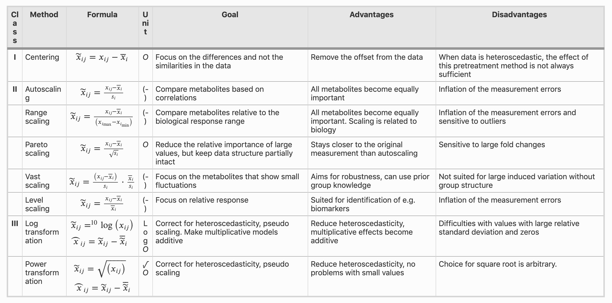

```{r, echo=TRUE, message = FALSE}
# packages that we need for the notebook
require(preprocessCore)
require(sva)
require(pcaMethods)
require(gplots)
require(e1071)
source("black_box_svm.R")
```

# Before starting

- The purpose of this notebook is to introduce the user to common practices in data quality control, normalization and cleaning for life sciences data. 
- Please take a minute to think about why we are performing every step, do not rush through it. 
- There are several questions along the notebook, try to answer them by yourself before looking at the answers or the next section.
- If you want to try a specific data transformation that is not shown you can try to implement it yourself or ask for help and we can try to implement it.
- The nice thing about data science is that you can try several things and see what is the outcome of each quite quickly, so try different approaches and explore!
- Because bioinformatics is such a large field, it is impossible to cover all the possible scenarios, data types and data levels. Although the "techniques" that we will work on are mostly designed for omics datasets (transcriptomics, proteomics, metabolomics), try to transfer the presented ideas to your particular experiments.

# Introduction

Good models in machine learning require high quality data. Otherwise happens what we call *garbage in, garbage out*. Furthermore, prediction models need standardized data; otherwise the trained model will only work for the same particular set of data that was used for training. For these reasons, the first steps in machine learning are composed of data exploration and quality control; and are crucial to ensure that all the downstream tasks are not doomed from the start.

In this notebook we will be using a transcriptomics dataset of ColoRectal Cancer (CRC). CRC has four different subtypes (CMS1, CMS2, CMS3 and CMS4) that it can be classified to (you can read more about it [here](https://www.nature.com/articles/nm.3967)). Our objective is to train a machine learning model to classify a CRC sample into the four subtypes. For example, this would be useful if different subtypes receive different treatments, and we want to make sure that a new patient gets the best treatment possible.

We will go through a checklist of the main tasks to do before embarking in any machine learning process. This includes:

- Sample QC
- Normalization
- Scaling
- Batch correction
- Dealing with missing values
- Quick ML model example

Let's think about two characteristics about the data: 

- **Type of data**: in this case it is microarray data, but for other types of data (RNA-sequencing, metabolomics mass-spectrometry, proteomics mass-spectrometry, single-cell RNA-sequencing, genomics, ...), although the core concepts of quality control and data standardization are applicable, the method to apply these concepts can be entirely different.
- **Experiment design**: even within the same type of data, the design of the experiment will define which are the better or worse approaches to work with the data. It is not the same to do full proteome than to do a IP proteomics. When designing an experiment that will be mostly analyzed by bioinformatics it is extremely important to also include such bioinformatics analysis in the design process: *will I be able to properly normalize the data with the included samples? Do I have enough replicates? Should I include another sample to control for non-specific binding?* Bioinformatics does not do miracles for poorly designed experiments.

# The dataset

<details>
<summary>A little secret</summary>

- Although we are using the core data from the paper, it has been artificially modified to include examples of some problems that we might encounter in reality.

</details>

Loading the dataset: 

```{r}
sample_data <- read.table(file = 'rawdata/samples_data.txt', header = TRUE, sep = '\t')
expr_data <- read.table(file = 'rawdata/expr_data.txt', header = TRUE, sep = '\t')
gene_data <- read.table(file = 'rawdata/gene_data.txt', header = TRUE, sep = '\t')
```

We have just read 3 tables that contain the following information:

- `sample_data`: contains information about the different samples.
- `expr_data`: contains the actual data on gene expression, rows = genes and columns = samples.
- `gene_data`: contains information about the measured genes: common names, different ids, etc.

The dimensions of `expr_data` tell us about the amount of genes and samples.

```{r}
dim(expr_data)
```
We have 56 samples and 20742 genes.

We can take a look at the `sample_data` data.frame to see how does our experiment look like.

```{r}
sample_data
```

```{r}
str(sample_data)
```

```{r}
table(sample_data$CMS)
```

<details>
<summary>What can you say about the data?</summary>

- There are 56 samples

- Each sample is done in triplicate.

- There are 3 batches.

- Each replicate is in a different batch.

- Not all CMS subtypes are represented equally.

</details>


# Data normalization

## What is data normalization?

*Normalization* is a very broad term, it could also include data scaling and batch correction. For this notebook we will keep them separate and define normalization as the process to ensure that all the different samples are comparable between them.

Again, think about the type of data that we are working with and about the design of the experiment. Some examples:

- Microarray data is composed of intensities, a continuous value, while RNA-seq data is composed of counts, a discrete value. For these two methods, although both measure gene expression, not all normalization approaches will be valid. 
- In proteomics we could measure whole-proteome or measure protein binding to a certain protein that is being pulled down. In the first case we could assume that all samples should have a similar total amount of protein, but in the second case that would not be possible since each different condition could give drastic changes to the amount of bound proteins. 

*Different types of data -> different approaches for normalization*

*Different types of experiments -> different approaches for normalization*

## Just before we start

This is microarray data that has already been background corrected using the [RMA method](https://academic.oup.com/biostatistics/article/4/2/249/245074), moreover the data is log2 transformed.

## Looking at the data

A good starting point is to plot the different samples using [boxplots](https://en.wikipedia.org/wiki/Box_plot). This kind of visualization can give as a general overview of what is the data distribution in each sample.

```{r}

boxplot(expr_data)

```

<details>
<summary>This plot already shows some interesting distributions. What do you see?</summary>

- There are batch effects. These kind of batch effects should be already known in advance. It is important to know how the samples were processed and annotate which samples belong to which batch.

- There are two samples that have a much lower overall gene expression, perhaps something went wrong with them.

- Overall all most of the samples have a similar distribution with slighly different means.

</details>


## The *weird* samples

Because normalization takes into account data from all the samples it is important to make sure that all the samples are actually good. At first glance there seems to be two bad samples. Therefore, we have to make a decision on what to do with them: 

- We keep them.
- We trash them.

<details>
<summary>What can we do to explore a bit better these samples? Any ideas on what might be wrong with them?</summary>

We can for example look at the amount of missing values, do they just have overall low expression of many genes or is it just that they are not measured at all.

</details>

Let's take a look at the amount of missing values

```{r}
## sum the amount of missing values in each column (sample)
apply(expr_data, 2, function(x) sum(is.na(x)))

```

We an see that more than 2/3 of the probes have a missing value. That is not a good sign and will definitely affect our normalization statistics. Therefore we can remove these samples.

```{r}
## select column numbers with more than 10000 missing values
bad_samples <- which(apply(expr_data, 2, function(x) sum(is.na(x))) > 10000)
## remove such samples from our tables
expr_data <- expr_data[,-bad_samples]
sample_data <- sample_data[-bad_samples,]
```

We can check back at the boxplot to see if we have removed the correct ones.

```{r}
boxplot(expr_data)
```

Trashing samples is a simple method. It might be possible or not depending on the amount of samples that one has. Moreover, carefully consider if a bad sample is really due to technical error, perhaps there is some biology behind, and throwing away such samples might add bias to our experiment.

## Normalization approaches

Now we can actually normalize the data. There are several methods to do so, some more correct than others depending on the experiment design and the data type. The important concept here is that we want to make the measurements of genes comparable between samples. 

For example, if geneA has an expression of 2 in sampleA and an expression of 4 in sampleB; we want to be able to say that sampleB has double the expression because it is real and not because sampleB had double the input of mRNA in the microarray.

And finally, normalization implies that we have some assumptions about the data and the experiment. Different normalization approaches imply different assumptions, and these can help us decide which method fits best for our experiment.

<details>
<summary>What would be some fair assumptions about this experiment?</summary>

- All the samples should have a comparable total amount of mRNA.

- All the samples should have similar distributions.

</details>


With these assumptions mean substraction, median subsetraction or quantiles normalization would work. Furthermore, it is quite established that for microarray data quantiles normalization works well. Nevertheless we can explore what would these normalizations do to our data distributions.

### Mean substraction

```{r}
sample_mean <- apply(expr_data, 2, mean, na.rm = T)
boxplot(sweep(x = expr_data, MARGIN = 2, STATS = sample_mean, FUN = '-'))

```

### Median substraction

```{r}
sample_median <- apply(expr_data, 2, median, na.rm = T)
boxplot(sweep(x = expr_data, MARGIN = 2, STATS = sample_median, FUN = '-'))

```

### Quantiles normalization

```{r}
boxplot(normalize.quantiles(as.matrix(expr_data)))

```

```{r}
norm_data <- normalize.quantiles(as.matrix(expr_data))
```


## Questions

- Let's say you have done a proteomics pull down experiment on your favorite protein to see which are their binding partners. On one condition you have the WT protein; but in the other you deleted a piece of the protein genetically, and you expect that a significant portion of binding partners will not be able to bind now. How would you normalize such data?

# Batch effect removal

Batch effects are changes in the biological data that come from external factors. Different personnel performed the experiment, different machines, different days, different reagents, ...
These are important to correct, since they can have an important effect on the data, and lead us to the wrong conclusions. For this reason, it is important to check if we see any of these effects on the data. But even more important, is to know if we should expect these effects since we have designed and performed the experiment. And even if we have not done the experiment personally, we should know how it has been done and what is its design.

In the first boxplots that we made, we saw that there is some batch effect going on. We also know which are the samples that have been processed in the same batch from the `sample_data` data.frame.

After we have normalized the data, it seems like the batch effect is gone. But is it really gone? Other approaches to check for batch effects are unsupervised clustering and dimensionality reduction. We will not go into detail about explaining these since they are not the objective of this notebook. They are actually explained in depth in the PCA and Clustering notebook.

**Quick explanation about PCA**: each gene is a dimension, to plot all the data in one go we would need a ~25000 dimensional plot (which is of course impossible). To solve that, we join all the genes that behave similarly in one dimension. In the plots, each dot is a sample, similar samples will be together in the 2D space; and different samples will be separated. Keep in mind that these 2 dimensions are a subset of all the data, which means that although two samples might seem far away in a dimension they might be close in another dimension. PCAs are also ordered by the amount of variance that they explain, therefore PC1 will show the most variance, then PC2, PC3...

**Quick explanation about unsupervised clustering**: we will calculate the distance between a sample and all the others samples. Samples are like points in ~25000 dimensional space, therefore we can calculate their distance like [this](https://getcalc.com/formula/geometry/distance-between-two-points.png). We can do this for all the samples and we can see which ones are most similars and which are not. Notice that the formula we are using is for Euclidean distance, there are other distances and each one has its purpouses and assumptions.

## Checking by PCA

We can do a quick [Principle Components Analysis](https://en.wikipedia.org/wiki/Principal_component_analysis) (PCA) to see how the samples cluster together (similar samples should be together).

<details>
<summary>What do you expect to see in the PCA?</summary>

- Samples from the same CMS should cluster together.

- Triplicates within the CMS cluster should be closer together.

</details>

We will do a PCA and plot the scores of each sample and color them by CMS.

```{r}
## calculate the PCA components
pca_res <- pca(t(norm_data))
## plot PC1 and PC2 and color by CMS subtype
plot(pca_res@scores[,1], pca_res@scores[,2], col = sample_data$CMS)
```

And the same plot colored by batch.

```{r}
## color by batch
plot(pca_res@scores[,1], pca_res@scores[,2], col = sample_data$batch)
```

<details>
<summary>What do these PCA plots show?</summary>

- There is still a clear batch effect since the samples are clustered by batch.
</details>

## Checking by distance matrix

We can also calculate what is the distance between all the samples to see which ones are most similar and which are most different. 

```{r}
## calculate the distance matrix between samples
distance_matrix <- as.matrix(dist(t(norm_data), method = "euclidean", upper = TRUE, diag = TRUE))
```

```{r}
cms_colors <- c('red', 'blue', 'green', 'black')
batch_colors <- c('red', 'blue', 'green')
cms_colors_col <- cms_colors[sample_data$CMS]
batch_colors_col <- cms_colors[sample_data$batch]
```

```{r}
heatmap.2(x = distance_matrix, 
          trace = 'none', 
          ColSideColors = cms_colors_col)

```

The more red the color, the more similar two samples are with each other. The colors at the top display the CMS subtype. Do you see any clusters?

```{r}
heatmap.2(x = distance_matrix, 
          trace = 'none', 
          ColSideColors = batch_colors_col)

```


<details>
<summary>What do these heatmaps show?</summary>

- There is still a clear batch effect since the samples are clustered by batch.
</details>


## Correcting the batch effect

To correct the batch effect several methods have been implemented. For microarray data particularly, the [ComBat](https://academic.oup.com/biostatistics/article/8/1/118/252073) method has been shown to work particularly well. But for other types of data, single-cell rna-seq data there are other methods.

Notice that batch correction is a supervised approach, meaning that we need to know *a priori* which are the different batches.

```{r}

batch_corr_data <- sva::ComBat(norm_data, batch = sample_data$batch)

```

Now try to explore again the batch corrected data and see what happened.

## Explore by PCA

```{r}
pca_res <- pca(t(batch_corr_data))

```

```{r}

plot(pca_res@scores[,1], pca_res@scores[,2], col = sample_data$CMS)

```

```{r}

plot(pca_res@scores[,1], pca_res@scores[,2], col = sample_data$batch)

```

- What has changed?

## Explore by distance 

```{r}
distance_matrix <- as.matrix(dist(t(batch_corr_data), upper = TRUE, diag = TRUE))
```


```{r}

heatmap.2(x = distance_matrix, 
          trace = 'none', 
          ColSideColors = cms_colors_col)

```

```{r}
heatmap.2(x = distance_matrix, 
          trace = 'none', 
          ColSideColors = batch_colors_col)

```


## Questions

-  Why are not the different CMS subtypes not perfectly clustered together even after normalization and batch correction?

# Scaling

Scaling is also part of the normalization process. Scaling can be done on the samples and/or on the features.

- Scaling of the samples is done to make datasets compatible. If one dataset is in log2 scale, but the other is in log10 scale they are not compatible because the same feature will have significant different ranges depending on the dataset.

- Feature importance. It is important that features are all in a similar (if not the same) scale. For example, before we calculated the Euclidean distance, in it we calculated the difference between expression of genes. Let's consider that a geneA goes from expression of 1 to 1.2; in the same sample geneB goes from 0.1 to 0.2. geneB has quite a change in gene expression because it is doubled between samples; while geneA has a 20% increase. In Euclidean space now the difference is 0.2 and 0.1, making the change in expression of geneA the larger one. Therefore consider, for your particular experiment, which features should be the important ones, if there should be any at all.

In our example we already had the data a scaled a bit since we are working with log transformed values. Therefore making genes with really high expression less valuable compared to lower expressed genes. But we might consider scaling all the genes between 0-1, so that we only compare relative expression between samples.

## Scaling methods

There are several scaling methods, this [article](https://link.springer.com/article/10.1186/1471-2164-7-142) has a nice table with several scaling methods that can be used.



# Dealing with missing values

Missing values are quite common and it is important to understand why they exist in our dataset. Again, consider the type of data and the experiment design when thinking about this.

These are the different types:

- **Missing completely at random**: as the name indicates, these are values that you did not measure because of bad luck. Perhaps the probe was defective, the peptide did not fly well in the mass spec, etc.
- **Missing not at random**: these are values that are missing because of a reason. For example, the method has a limit of detection and this feature was below it. That does not mean that for example, the gene is not expressed, but rather we do not have the technology to detect its low level of expression. It could also be that the gene is actually not expressed at all because of a condition of the experiment. Or a metabolite is not detected because of the extraction method.
- **Missing because of the data processing**: these should be quite easily detectable. These are actually values that we had measured at some point and that became missing because of some processing step. For example, we tried to take the log of a negative number or calculate the mean of a set that contained a `NA` value. It is important to always check our data before and after each processing step, and make sure that everything is as we expect it to be. 

There are different types of missing values, it is crucial to be able to differentiate between them whenever possible since the methods that are used to deal with each type are different. Sadly, most of the times we have a combination of these different types and it can be difficult to confidently tell which on is which. 

In R missing values are usually denoted as `NA`, but it might be different in other platforms. Consider also if `0` is a missing value or means that it was not truly measured.

Let's explore how many missing values we have.

```{r}
sum(is.na(expr_data))
```

And how many non missing values.

```{r}
sum(!is.na(expr_data))
```

So there are not so many missing values. Still we want to decide what to do with them. So let's try to find out which type of missing values are they. 

<details>
<summary>How would you check which kind of missing values are they?</summary>

- See if there are any samples with a lot/very few missing values.

- See if there are any features with a lot/very few missing values.

- See in which part of the distribution are the missing values.

</details>

Missing values per sample.

```{r}
apply(expr_data, 2, function(x) sum(is.na(x)))

hist(apply(expr_data, 2, function(x) sum(is.na(x))))
```

Seems that most samples have between 30-35 missing values. We actually already took care of two samples before that had a lot of missing values. So it doesn't look like there is anything too worrying here. If all the missing values where in one sample for example, then we might want to further investigate that.

Missing values per gene.

```{r}
table(apply(expr_data, 1, function(x) sum(is.na(x))))
```

Most genes have 0 missing values and then there are some have from 1 to 20. 

<details>
<summary>Notice anything strange about these values?</summary>

- Why such a change from 2 to 18 missing values?.

</details>

Perhaps by using a heatmap we can spot what is happening.

We can use colors to tell the different subtypes apart:
- Orange: CMS1
- Blue: CMS2
- Green: CMS3
- Yellow: CMS4

```{r}
colors <- c('CMS1' = "#E69F00", 'CMS2' = "#56B4E9", 
            'CMS3' = "#009E73", 'CMS4' = "#F0E442")
colors_vec <- sapply(sample_data$CMS, function(x) {
  return(colors[as.character(x)])
})
```

```{r}
## reduce the plot to only genes that at least 1 missing value
genes_with_nas <- which(apply(expr_data, 1, function(x) sum(is.na(x))) > 0)
reduced_mat <- as.matrix(expr_data[genes_with_nas,])

heatmap.2(reduced_mat, Rowv = NULL, Colv = NULL, 
          dendrogram = 'none', scale = 'none', trace = 'none', 
          ColSideColors = colors_vec, na.color = 'grey30')

```

<details>
<summary>What are your first impressions?</summary>

- It looks quite random, although most of the data is at the lower end of the expression distribution. Probably most of these missing values are just "random" because of the limit of detection.

</details>

We can focus only on the genes that have between 1 and 5 missing values.

```{r}
genes_with_nas <- which(apply(expr_data, 1, function(x) sum(is.na(x))) > 0 & 
                          apply(expr_data, 1, function(x) sum(is.na(x))) < 6)
reduced_mat <- as.matrix(expr_data[genes_with_nas,])

heatmap.2(reduced_mat, Rowv = NULL, Colv = NULL,
          dendrogram = 'none', scale = 'none', trace = 'none', 
          ColSideColors = colors_vec, na.color = 'grey30')

```

<details>
<summary>What are your first impressions?</summary>

- Very similar to as before, this is expected since most of the genes had less than 3 missing values.

</details>

We can check the genes with more than 5 missing values

```{r}
genes_with_nas <- which(apply(expr_data, 1, function(x) sum(is.na(x))) > 5)
reduced_mat <- as.matrix(expr_data[genes_with_nas,])

heatmap.2(reduced_mat, Rowv = FALSE, Colv = FALSE, 
          dendrogram = 'none', scale = 'none', trace = 'none', 
          ColSideColors = colors_vec, na.color = 'grey30')

```

<details>
<summary>What are your first impressions?</summary>

- These are genes that are clear on the low end of expression. Probably missing because of the limit of detection. Besides that it would seem random.
- There is one gene that stands out! it appears that is detected with high expression in all samples but the ones in CMS2!

</details>

So far we have explored our missing values. It looks like the majority of them are random, with emphasis at missing at random but with a detection limit component. Finally there is one gene that has not at random missing values.

Now we have to decide what do we do with these missing values. Again, depending on the type of data and experiment we might want to keep the missing values, remove them or impute them. It is important to decide whether the missingness of a value has information or not.

Some options of what we can do:

- The simple and extreme case would be to remove all genes with missing values. This is a simple method that will give you a dataset with no missing data. 
- Another method would be to remove genes that have a lot of missing values but keep the ones with few missing values. The threshold is quite arbitrary.
- Another method would be to impute them, this means giving them an actual measurement. But which measurement should we give them? This option even opens more options, in which we have to decide which imputation method we want to use, some examples would be:
  - Use the average of the sample
  - Use a value close to the limit of detection
  - Impute it based on its most similar sample
  
<details>
<summary>What would you do?</summary>

Dealing with missing values is quite complex and is extremely dependent on the experiment. In this particular case our final objective is to build a predictor, a predictor needs to be robust, therefore using genes that are sometimes detected and sometimes not is not a good idea. Since most of the values seem random imputation based on the most similar sample would probably work fine. On the other hand, since there are not so many genes that actually have missing values we could also not use them.

</details>

We can also try different methods, and then see how the data looks like; specially in this case since we are adding data that will be as important as the real data we want to check that we are not creating any aberrations.

Removing missing genes.

```{r}
genes_to_remove <- which(apply(expr_data, 1, function(x) sum(is.na(x))) > 0)

reduced_data <- expr_data[-genes_to_remove,]

```

Setting missing values as the sample mean.

```{r}
mean_col <- apply(expr_data, 1, mean, rm.na = TRUE)
imputed_data <- expr_data
for (i in seq_len(ncol(imputed_data))) {
  
  col_data <- imputed_data[,i]
  col_data[is.na(col_data)] <- mean_col[i]
  imputed_data[,i] <- col_data
  
}

```

Setting missing values as a lower quantile value.

```{r}

quantile(expr_data, na.rm = T)
imputed_data <- expr_data
imputed_data[is.na(imputed_data)] <- quantile(expr_data, na.rm = T)[1]

norm_imputed <- normalize.quantiles(as.matrix(imputed_data))

norm_imputed_batchcorr <- sva::ComBat(norm_imputed, batch = sample_data$batch)

```

## Questions

- How can you determine if a sample has too many missing values?
- When do we impute/remove missing values? Before or after normalization?


# Feature selection (pre-ML)

This part will very briefly touch on aleviating the amount of data given to to train/predict. We have measured ~25000 genes, but to predict the different subtypes just a few of them are necessary. In this follow-up [paper](https://www.ncbi.nlm.nih.gov/pmc/articles/PMC5864202/) they built a classifier with 113 probes. Therefore it would reduce the amount of computation time and difficulty for the algorithms if we could *a priori* reduce the amount of features. There is also the consideration of robustness, reducing the amount of required features is nice, but reducing it too much might make our method too unstable, having some redundancy is also nice.

This part is highly dependent on the machine learning method used, some methods have feature selection already incorporated in the algorithm itself, while some others do not. You can read about it [here](http://topepo.github.io/caret/feature-selection-overview.html).

Nevertheless, let's say that our algorithm does not have feature selection.

**IMPORTANT**: feature selection is part of ML, therefore we must apply cross-validation methods to ensure that we are not overestimating the performance of our model. 

<details>
<summary>What kind of metrics could we used to reduce the amount of features?</summary>

- Features that have near zero variance: if the expression of a gene does not change across samples it will not be informative.

- Correlated features: if two or more genes have a highly correlated expression, they contain the same information.

- Linear dependencies: if the expression of a gene can be calculated by the mathematical combination of two or more other genes. 

</details>

## Zero variance features

We can check how many features have low variance.

```{r}
hist(apply(batch_corr_data, 1, var, na.rm = T), xlim = c(0, 5), breaks = 100, main = "Variance")
```

As we can see, many of them have very low variance, these are not very informative. 

<details>
<summary>Does higher variance correlate with better class separation?</summary>

- We actually do not know that. It simply tells us how disperse is a feature. 

</details>

In this case we could remove genes that have less than a certain variance threshold.

```{r}
relevant_genes <- which(apply(batch_corr_data, 1, var, na.rm = T) > 0.5)

batch_corr_data <- batch_corr_data[relevant_genes,]

length(relevant_genes)
```

## Highly correlated genes

We could remove groups of genes that have high correlation, since in that case they would contain the same information. 

This of course requires to set up a threshold on what does high correlation means.


```{r}

descrCor <-  cor(batch_corr_data, use = 'complete.obs')

hist(descrCor)
```

Perhaps we could compress all the highly correlated genes into a single meta-gene. This would be essentially PCA, which also includes the variance problem described above in it.

# Some quick ML

We can try different combinations of the above described methods (normalization, scaling, dealing with missing values) and see what is their effect on training a model.

To get some reliable values we will do a simple quick cross-validation by setting up a subset of the samples separated. Let's keep for example the 3rd batch out.

## With normalization, imputation and batch correction

```{r}

x_train <- norm_imputed_batchcorr[, sample_data$batch %in% c(1, 2)]
x_validation <- norm_imputed_batchcorr[, sample_data$batch %in% c(3)]
y_train <- sample_data$CMS[sample_data$batch %in% c(1, 2)]
y_validation <- sample_data$CMS[sample_data$batch %in% c(3)]

```

```{r}

model <- build_model(x_train, y_train)
predictions <- predict_new_data(x_validation, model)
performance(y_validation, predictions)

```

Let's try with other datasets, for example if we use `norm_imputed` that has not been batch corrected, will it work? You can try other states of the dataset, unfortunately this machine learning method does not deal automatically with missing values, so you will have to take care of them first.

## With normalization, imputation and NOT batch correction

```{r}

x_train <- norm_imputed[, sample_data$batch %in% c(1, 2)]
x_validation <- norm_imputed[, sample_data$batch %in% c(3)]
y_train <- sample_data$CMS[sample_data$batch %in% c(1, 2)]
y_validation <- sample_data$CMS[sample_data$batch %in% c(3)]

```

```{r}

model <- build_model(x_train, y_train)
predictions <- predict_new_data(x_validation, model)
performance(y_validation, predictions)

```

## With normalization, imputation, batch correction and randomized labels

```{r}

x_train <- norm_imputed[, sample_data$batch %in% c(1, 2)]
x_validation <- norm_imputed[, sample_data$batch %in% c(3)]
y_train <- sample_data$CMS[sample_data$batch %in% c(1, 2)]
y_validation <- sample_data$CMS[sample_data$batch %in% c(3)]

y_train <- sample(y_train, length(y_train))

```

```{r}

model <- build_model(x_train, y_train)
predictions <- predict_new_data(x_validation, model)
performance(y_validation, predictions)

```

# Beyond data wrangling

- Cross-validation
- Class balance

# Conclusions

In this notebook we have learned about some of the key aspects of data pre-processing, exploration and cleaning. Keep in mind, that the methods that we have applied here are particularly suited for this kind of data and experiment. It is of extreme importance to research which are the adequate methods for each type of dataset and type of experiment.
